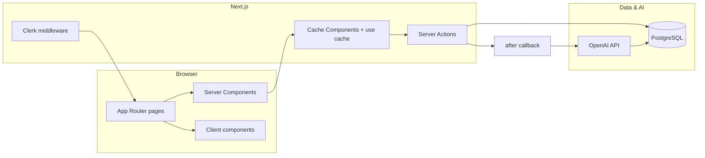

# MOOD

A personal journaling web app with **AI-assisted mood insights**, mood **trends charts**, and **Clerk** authentication. Built for fast iteration on **Next.js 16** (App Router, Cache Components) with **PostgreSQL** via **Prisma**.

---

## Features

- **Journal entries** — Create, edit, and list entries scoped per user.
- **AI analysis** — After save, summaries, mood score (1–10), and short feedback are generated (OpenAI via Vercel AI SDK) and stored as `Analysis` rows.
- **Dashboard** — Protected routes for journal, per-entry editor, and mood chart (Recharts).
- **Onboarding** — `/new-user` syncs Clerk users into the local `User` table.
- **Caching** — Server data uses `'use cache'`, `cacheTag` / `updateTag`, and partial prerendering-compatible `Suspense` boundaries.

---

## Tech stack

| Layer | Choice |
|--------|--------|
| Framework | **Next.js 16** (App Router, React 19, Turbopack dev) |
| UI | **React 19**, **Tailwind CSS 4**, **Lucide** icons |
| Compiler | **React Compiler** (`babel-plugin-react-compiler`) |
| Auth | **Clerk** (`@clerk/nextjs`) |
| Database | **PostgreSQL** (e.g. **Neon**) |
| ORM | **Prisma 7** + **pg** adapter / connection pool |
| AI | **Vercel AI SDK** (`ai`, `@ai-sdk/openai`, structured output + **Zod**) |
| Charts | **Recharts** (dynamic import on chart route) |
| Testing | **Vitest**, **Testing Library**, **MSW** |
| Validation | **Zod** |

> **Note:** `drizzle-orm` / `drizzle-kit` are present in `package.json`; primary data access in app code is **Prisma**.

---

## Architecture (high level)



- **Routing** — `src/app` with route groups `(dashboard)` for authenticated shell (sidebar, nav).
- **Auth** — `src/middleware.ts` protects non-public routes; public: `/`, sign-in/up, `/new-user`.
- **Mutations** — `src/actions/post.ts` creates/updates entries, triggers **non-blocking** `after()` work for AI, then **`updateTag` / `revalidatePath`** so lists and chart stay consistent.
- **Reads** — `src/utils/db-helpers.ts` and `src/utils/auth.ts` use cached loaders with **`cacheTag`** keyed by user for journal list / analyses / user row.
- **Prisma client** — `src/utils/db.ts` singleton with a **small `pg` pool** (`max: 1`) suited to serverless-style invocations.

---

## Repository layout

```
src/
  app/                 # App Router: layouts, pages, route-private _components/
  actions/             # Server Actions (posts, journal helpers)
  components/          # Shared UI (Editor, Chart, cards, …)
  generated/prisma/    # Generated Prisma client (see schema)
  middleware.ts        # Clerk
  utils/               # db, auth, db-helpers, ai, dates
prisma/
  schema.prisma        # User, Entry, Analysis
```

---

## Prerequisites

- **Node.js** 20+ (aligned with `@types/node`)
- **PostgreSQL** connection string
- **Clerk** application (publishable + secret keys)
- **OpenAI** API key (for AI analysis and optional Q&A features)

---

## Environment variables

Create a `.env` in the project root (never commit secrets). Typical variables:

| Variable | Purpose |
|----------|---------|
| `DATABASE_URL` | PostgreSQL URL for Prisma and `pg` |
| `NEXT_PUBLIC_CLERK_PUBLISHABLE_KEY` | Clerk browser key |
| `CLERK_SECRET_KEY` | Clerk server key |
| `OPENAI_API_KEY` | OpenAI for `ai` / `@ai-sdk/openai` |

Use the exact names expected by [Clerk Next.js](https://clerk.com/docs/quickstarts/nextjs) and the [AI SDK](https://sdk.vercel.ai/docs) if your versions differ.

---

## Setup

```bash
npm install
npx prisma migrate dev          # or db push in early development
npm run dev
```

- **Develop:** [http://localhost:3000](http://localhost:3000)
- **Prisma client:** Regenerated on `postinstall` (`prisma generate`).

---

## Scripts

| Command | Description |
|---------|-------------|
| `npm run dev` | Next dev server (Turbopack) |
| `npm run build` | Production build |
| `npm run start` | Production server |
| `npm run lint` | ESLint |
| `npm test` | Vitest |

---

## Turbopack / monorepo note

If a **parent directory** contains an extra `package-lock.json`, Next may infer the wrong workspace root and fail to resolve `tailwindcss`. This repo sets **`turbopack.root`** in `next.config.ts` to the directory that holds `package.json` and `node_modules`. Prefer **one lockfile per app** or keep that setting.

---

## Deployment

- **Vercel** (or similar) with PostgreSQL (e.g. **Neon**), environment variables set, and Prisma migrations applied in CI or release step.
- Ensure **Clerk** URLs and **OpenAI** billing/limits match production traffic.

---

## Security & privacy

- All journal and analysis data is **scoped by authenticated user** in server actions and Prisma queries.
- Do not expose `DATABASE_URL`, `CLERK_SECRET_KEY`, or `OPENAI_API_KEY` to the client.

---

## License

Private project (`"private": true` in `package.json`). Add a license file if you open-source.
